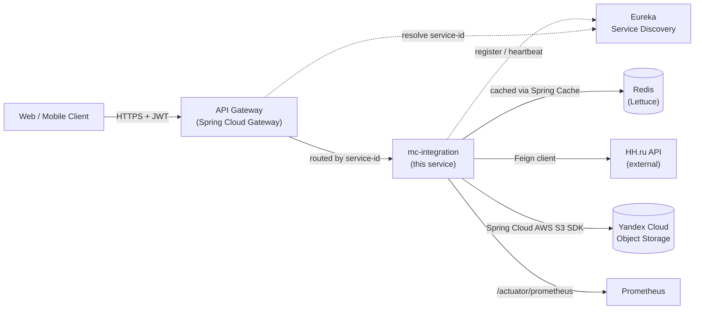

# mc-integration

> Integration microservice for a social-network platform, handling external API access (HH.ru geographic data) and cloud object storage (Yandex Cloud, S3-compatible) for user images.

[](https://openjdk.org/projects/jdk/21/)
[](https://spring.io/projects/spring-boot)
[](https://spring.io/projects/spring-cloud)
[](LICENSE)

---

## Table of contents

- [Overview](#overview)
- [Architecture](#architecture)
- [Tech stack](#tech-stack)
- [Key technical decisions](#key-technical-decisions)
- [API](#api)
- [Configuration](#configuration)
- [Running locally](#running-locally)
- [Observability](#observability)
- [Project structure](#project-structure)
- [Roadmap & known limitations](#roadmap--known-limitations)
- [License](#license)

---

## Overview

`mc-integration` is one microservice in a larger social-network platform composed of multiple independently deployable services discovered via Eureka and routed through an API Gateway. This service owns two responsibilities:

1. **Geographic reference data** — proxying and caching countries / cities from the HH.ru public API for use across the platform's user profile flows.
2. **User image storage** — uploading and deleting user-uploaded images via an S3-compatible interface (Yandex Cloud Object Storage in production; can be pointed at AWS S3 or MinIO with a configuration change).

The service does not own a relational database. State that needs to survive restarts lives in Redis (cache) or external object storage (S3).

## Architecture



**Where this service sits:**

- Behind the Gateway — never exposed directly to clients.
- Validates incoming JWTs as an **OAuth2 Resource Server**; it does not issue tokens.
- Caches expensive external calls (HH.ru) in Redis with per-cache TTLs.
- Streams uploaded images directly to S3 — no local disk persistence.

## Tech stack

| Layer | Technology |
|---|---|
| Language | Java 17 |
| Framework | Spring Boot 3, Spring Security 6 |
| Service discovery | Spring Cloud Netflix Eureka (client) |
| Gateway integration | Spring Cloud Gateway (this service is registered behind it) |
| External HTTP | Spring Cloud OpenFeign |
| Object storage | Spring Cloud AWS S3 (against Yandex Cloud Object Storage) |
| Cache | Redis (Lettuce client) |
| Security | OAuth2 Resource Server, JWT RS256 (asymmetric) |
| Observability | Spring Boot Actuator, Micrometer, Prometheus |
| Build | Maven |
| Conveniences | Lombok |

## Key technical decisions

This section explains *why* the code looks the way it does — the kind of context that's normally lost when you only read source files.

### 1. OAuth2 Resource Server with RS256, not HS256

The platform uses a separate auth service that issues JWTs signed with an RSA private key. `mc-integration` validates tokens using only the matching **public key** (`NimbusJwtDecoder.withPublicKey(...).signatureAlgorithm(RS256)`).

This means a compromise of this service does not allow an attacker to forge tokens — only the auth service holds the signing key. In a symmetric-key (HS256) setup, every resource server would hold the secret, multiplying the attack surface.

### 2. Custom `JwtAuthenticationConverter` with empty authority prefix

Spring Security's default `JwtGrantedAuthoritiesConverter` prepends `SCOPE_` (or `ROLE_` if configured) to authorities extracted from the token. Our auth service already issues authorities as `ROLE_USER`, `ROLE_ADMIN`, etc., so the converter is configured with:

```java
authoritiesConverter.setAuthoritiesClaimName("roles");
authoritiesConverter.setAuthorityPrefix("");
```

This avoids double-prefixing (`ROLE_ROLE_USER`) and lets `@PreAuthorize("hasRole('USER')")` work as expected. `@EnableMethodSecurity` is enabled to support method-level authorization.

### 3. Stateless sessions

`SessionCreationPolicy.STATELESS` — every request is authenticated independently by its JWT. No server-side session state. This is what makes horizontal scaling trivial: a load balancer can route the next request to any instance without sticky sessions.

CSRF protection is disabled for the same reason — without server sessions, there is no session cookie for an attacker to ride.

### 4. Lettuce over Jedis for Redis

Lettuce is non-blocking (Netty-based), thread-safe across multiple connections, and works well with Spring's reactive APIs if we later need them. Jedis requires a connection pool and blocks the calling thread on every operation.

### 5. Spring Cache abstraction with per-cache TTLs

Geographic data from HH.ru changes rarely. Rather than hand-rolling Redis calls, the service uses `@Cacheable` on the service layer with two named caches:

```yaml
app.cache.caches:
  hh-countries:
    expiry: 120h
  hh-cities:
    expiry: 120h
```

This keeps the call sites clean (`@Cacheable("hh-countries")`) and lets cache infrastructure be swapped (Redis → Caffeine → Hazelcast) without touching business logic.

### 6. Feign client for external HTTP

Feign over `RestTemplate` / `WebClient` gives:

- Declarative interface-based HTTP clients
- Built-in integration with Eureka (call services by name)
- Configurable timeouts at one place
- Easy to add a `CircuitBreaker` decorator (planned — see [Roadmap](#roadmap--known-limitations))

### 7. Yandex Cloud Object Storage via Spring Cloud AWS S3

Yandex Cloud exposes an S3-compatible API, so the same Spring Cloud AWS S3 SDK works against it by pointing the endpoint at `https://storage.yandexcloud.net`. Switching to AWS S3 or MinIO is a configuration change — no code touches.

### 8. Production-ready observability defaults

- `/actuator/health` exposes Kubernetes-compatible **liveness** and **readiness** probes (`management.endpoint.health.probes.enabled=true`).
- `/actuator/prometheus` exposes Micrometer metrics tagged with `application=mc-integration`, scraped by Prometheus.
- The Gateway routes `/actuator/integration/**` to `/actuator/**` on this service so operators can hit health and metrics from the public Gateway URL without exposing actuator publicly.

## API

When the service is running, OpenAPI documentation is available at:

- Swagger UI: <http://localhost:8765/swagger-ui/index.html>
- OpenAPI spec: <http://localhost:8765/v3/api-docs>

All endpoints (except actuator health and Swagger) require a valid JWT in the `Authorization: Bearer <token>` header.

### Endpoints

#### Geographic data

| Method | Path | Description |
|---|---|---|
| `GET` | `/api/v1/geo/country` | List all countries |
| `GET` | `/api/v1/geo/country/{countryId}/city` | List cities for a given country |

#### Storage

| Method   | Path | Description |
|----------|---|---|
| `POST`   | `/api/v1/storage/storageUserImage` | Upload a user image (multipart/form-data) |
| `DELETE` | `/api/v1/storage/deleteByLink?linkToDelete=...` | Delete an image by its public link |

## Configuration

All sensitive values are read from environment variables. The defaults in `application.yaml` are for local development only.

| Variable | Description | Default |
|---|---|---|
| `JWT_PUBLIC_KEY_PATH` | Path to RSA public key (PEM) for JWT validation | `classpath:/keys/public.pem` |
| `SPRING_DATA_REDIS_HOST` | Redis host | `localhost` |
| `REDIS_PASS` | Redis password | *(required)* |
| `YC_S3_ACCESS_KEY` | Yandex Cloud / AWS S3 access key | *(required)* |
| `YC_S3_SECRET_KEY` | Yandex Cloud / AWS S3 secret key | *(required)* |
| `EUREKA_HOST` | Eureka server URL | `http://localhost:8761/eureka/` |

A `.env.example` file is provided in the repository as a template. Copy it to `.env`, fill in the values, and source it before running.

## Running locally

### Prerequisites

- Java 17+
- Maven 3.8+
- Docker & Docker Compose (for Redis and a mock Eureka)

### Quick start

```bash
# 1. Clone the repository
git clone https://github.com/AlexNickG/mc-integration.git
cd mc-integration

# 2. Copy and fill the environment file
cp .env.example .env
# edit .env with your values

# 3. Start dependencies (Redis, Eureka)
docker compose up -d

# 4. Run the service
./mvnw spring-boot:run
```

The service will be available at <http://localhost:8765>.

### Verify

```bash
# Health check (no auth required)
curl http://localhost:8765/actuator/health

# Get an access token from the auth service, then:
curl -H "Authorization: Bearer $TOKEN" \
     http://localhost:8765/api/v1/geo/country
```

## Observability

| Endpoint | Purpose |
|---|---|
| `/actuator/health` | Overall health |
| `/actuator/health/liveness` | Kubernetes liveness probe |
| `/actuator/health/readiness` | Kubernetes readiness probe |
| `/actuator/prometheus` | Prometheus metrics scrape endpoint |
| `/actuator/info` | Build info |

Metrics include JVM stats (heap, GC, threads), HTTP server timings, Feign client latencies, cache hit/miss ratios, and Redis connection pool stats — all tagged with `application=mc-integration`.

## Project structure

```
src/main/java/ru/skillbox/socialnetwork/integration/
├── configuration/
│   └── security/
│       ├── SecurityConfiguration.java   # OAuth2 Resource Server, route authorization
│       ├── JwtConfig.java               # NimbusJwtDecoder with RSA public key
│       └── CorsConfig.java              # CORS rules
├── controller/
│   ├── LocationController.java          # /api/v1/geo
│   └── StorageController.java           # /api/v1/storage
├── service/
│   ├── LocationService.java             # HH.ru integration, caching
│   └── StorageService.java              # S3 upload/delete
├── client/                              # Feign clients
└── dto/                                 # Request / response DTOs
```

## Roadmap & known limitations

This is a learning / portfolio project and I'm transparent about what's not production-grade yet.

### v1.1 (next)

- [ ] **Validation** — `@Validated` on controllers, `@Min(1)` on `countryId`, `@NotBlank` on `linkToDelete`.
- [ ] **Global error handling** — `@ControllerAdvice` with structured `ProblemDetail` (RFC 7807) responses instead of generic 500s.
- [ ] **OpenAPI annotations** — `@Operation`, `@ApiResponse` on every endpoint so Swagger UI is genuinely useful.
- [ ] **Integration tests** — Testcontainers for Redis; mock JWT issuer for security flow.

### v1.2

- [ ] **Resilience4j Circuit Breaker** around the HH.ru Feign client — currently a slow HH.ru would block our threads.
- [ ] **Retry with backoff** for transient S3 failures.
- [ ] **Distributed tracing** via Micrometer Tracing + Zipkin / Tempo.

### Acknowledged design debts

## License

MIT — see [LICENSE](LICENSE) for details.

---

*Part of the [social-network](https://github.com/AlexNickG?tab=repositories) microservices platform. Built as a learning project; design decisions and trade-offs are documented to facilitate code review and discussion.*
